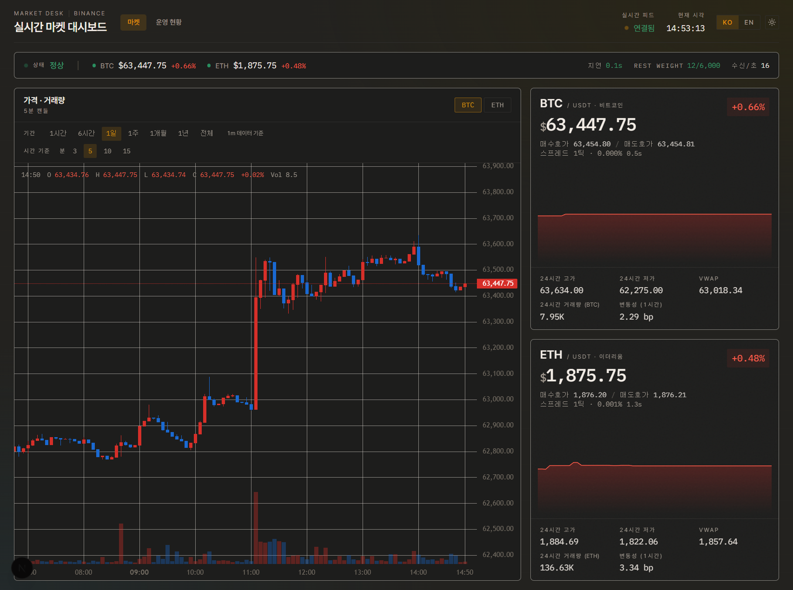
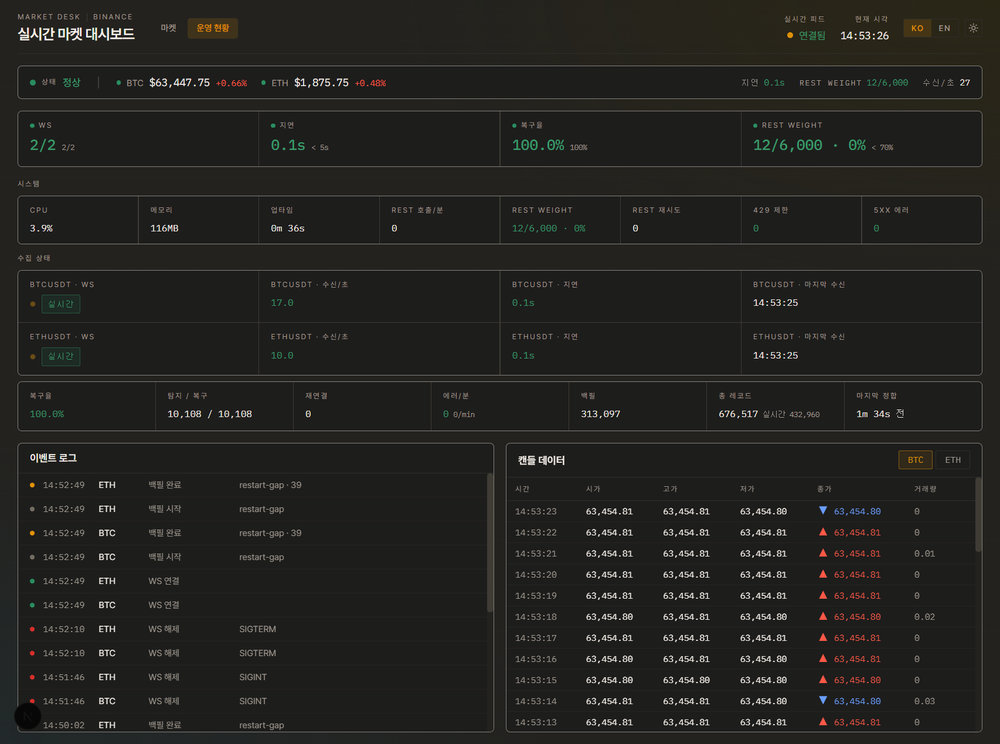

<div align="center">

# 📡 Market Desk

**Binance BTCUSDT · ETHUSDT 실시간 수집 파이프라인과 운영 대시보드**

데이터가 *끊김 없이 · 지연 없이 · 완결성 있게* 들어오는지 감시하면서, 동시에 시장 현황을 봅니다.

[](https://nextjs.org/)
[](https://react.dev/)
[](https://www.typescriptlang.org/)
[](https://www.sqlite.org/)
[](https://tailwindcss.com/)
[](https://binance-docs.github.io/apidocs/spot/en/)
[](#-동작-검증)

[빠른 시작](#-빠른-시작) · [요구사항 충족](#-과제-요구사항-충족) · [주요 기능](#-주요-기능) · [아키텍처](#-아키텍처) · [설계 결정](#-핵심-설계-결정) · [문서](#-문서)

</div>

<!--
  스크린샷 추가 방법: 이미지를 docs/ 에 넣고 아래 주석을 해제하세요.
  대시보드 제품이므로 화면 캡처 한 장이 설명 열 줄보다 효과적입니다.

  | 마켓 (`/`) | 운영 현황 (`/ops`) |
  |---|---|
  |  |  |
-->

---

## 🚀 빠른 시작

**Node.js 20 이상**이면 됩니다. Binance **API 키는 필요 없습니다** — 공개 마켓 데이터만 사용합니다.

```bash
git clone https://github.com/SBKIM9704/binance-realtime-dashboard.git
cd binance-realtime-dashboard
npm install
cp .env.example .env      # 기본값 그대로 동작합니다
npm run dev               # 수집기 + 대시보드 동시 실행
```

→ **<http://localhost:3000>**

수집기는 기동 시 설정 요약을 찍고, 백필이 끝나면 **방금 수집한 가격을 아스키 스파크라인으로** 그린
준비 완료 카드를 출력합니다.

```
  █▀▄▀█ ▄▀█ █▀█ █▄▀ █▀▀ ▀█▀   █▀▄ █▀▀ █▀ █▄▀
  █ ▀ █ █▀█ █▀▄ █ █ ██▄  █    █▄▀ ██▄ ▄█ █ █
  Binance realtime collector

  symbols   BTCUSDT · ETHUSDT
  interval  1s  (view roll-ups derived on read)
  history   1m:30 1h:all
  retention 7d  (live interval only)
  database  ./data/market.db

  ● ready  backfill 0.6s

  BTCUSDT    152,645 rows  ▃▃▂▁▁▁▁▁▁▁▁▁▁▁▁▁▁▁▁▁▁▁▁▁▁▄██████████████████████
           63,556.03  +0.02%   gaps 1597/1597 ✓
```

> **최초 실행**은 `BACKFILL_DAYS`(기본 3일)치 1초봉을 채운 뒤 실시간 수집을 시작하며, 동시에
> 히스토리 티어를 백그라운드로 받습니다 — 기본 설정 기준 **약 80초 · 250 REST 요청 · 20MB**(2종목 합계).
> 티어 백필은 실시간 수집을 막지 않습니다.

<br />

## ✅ 과제 요구사항 충족

| 요구사항 | 구현 | 위치 |
|---|---|---|
| **Part 1** · BTCUSDT·ETHUSDT 실시간 수집 | WebSocket 결합 스트림 (`kline_1s` + `bookTicker`) | [`collector/ingest.ts`](src/collector/ingest.ts) |
| **Part 1** · 최초 실행 시 백필 | 저장 이력 없음 → `BACKFILL_DAYS`치 전체 백필 (`first-run`) | [`collector/backfill.ts`](src/collector/backfill.ts) |
| **Part 1** · 재시작 후 누락 구간 백필 | 마지막 캔들 ~ 현재 구간만 채움 (`restart-gap`) + 주기적 reconciler | [`backfill.ts`](src/collector/backfill.ts) · [`reconcile.ts`](src/collector/reconcile.ts) |
| **Part 2** · 운영 대시보드 | 마켓(`/`) · 운영 현황(`/ops`) 2개 화면 | [`app/(dash)/`](src/app) |
| **Part 2** · 실시간 확인 | SSE(`/api/stream`) 1초 주기 push | [`api/stream/`](src/app/api/stream) |
| **Part 2** · 지표 선택 이유·근거 문서 | 설계 원칙 · 계층 구조 · 임계값 근거 · 장애 시나리오 | **[`docs/dashboard-metrics.md`](docs/dashboard-metrics.md)** |
| **제출** · 실행 방법 · 환경변수 | [빠른 시작](#-빠른-시작) · 하단 접힌 섹션 · [`.env.example`](.env.example) | — |

> 요구대로 최초 실행·재시작 백필은 **별개 기능이 아니라 하나의 gap 탐지 + REST 채움 메커니즘**으로
> 구현했습니다.

<br />

## ✨ 주요 기능

| | 기능 | 설명 |
|:--:|------|------|
| ⚡ | **실시간 수집** | WebSocket 결합 스트림으로 2종목 상시 수집, 지수 백오프 자동 재연결 |
| ⏮️ | **통합 백필** | "최초 실행"과 "재시작 누락"을 하나의 메커니즘으로 처리 + 주기적 reconciler |
| 🗄️ | **다해상도 저장** | 1초봉(운영용 7일) + 코스 티어(1분봉 30일 · **1시간봉 2017년부터**) |
| 🧮 | **온디맨드 롤업** | 큰 봉은 수집하지 않고 **조회 시 SQL 집계** — 인터벌을 늘려도 수집·스키마 불변 |
| 🎯 | **출처 인식 집계** | 24h 지표는 구간을 덮으면서 조밀한 티어를 자동 선택 → 공표치 대비 오차 **0.03% 이내** |
| 🚨 | **낡은 데이터 방지** | 스트림이 끊기면 상태를 위험으로 강제하고 수치를 흐림 처리 |
| 📊 | **캔들 차트** | 기간 프리셋 7종(1시간~전체) · 국내 거래소식 시간 기준 선택 |
| 🚦 | **임계값 색상 코딩** | Lag·복구율·Weight·에러율을 색으로 즉시 판단, **임계값을 값 옆에 인쇄** |

<details>
<summary><b>나머지 기능 펼치기</b></summary>

<br />

| | 기능 | 설명 |
|:--:|------|------|
| 📈 | **운영 관측성** | 지연·Msg/s·결측/복구율·WS 상태·에러·이벤트 로그를 `/ops`에 노출 |
| 🖥️ | **System 지표** | 수집기 CPU/RAM/uptime + REST calls/Weight(x/6000)·429·5xx |
| 📖 | **호가/심화 시세** | `@bookTicker` 실시간 Bid/Ask + 틱 단위 스프레드 + 호가 신선도 |
| ⚙️ | **효율적 실시간 UI** | 스냅샷을 **매초 1회만 계산해 전 탭이 공유** (탭 수와 무관) |
| ♿ | **접근성** | 포커스 링 · 24px 터치 타깃 · `aria-live` · 색 단독 인코딩 금지 · `prefers-reduced-motion` |
| 🧍 | **클라이언트 독립 수집** | 수집기는 브라우저와 분리된 상주 프로세스 → 페이지를 몇 개 열든 축적 |
| ♻️ | **보존 정책** | `RETENTION_DAYS` 지난 수집 인터벌 캔들/이벤트 자동 정리 (히스토리 티어는 보존) |
| 🌗 | **다크/라이트 · 한/영** | 쿠키 저장으로 SSR 첫 렌더부터 정확(플리커 없음). 등락 색은 언어 관례를 따름 |
| 💾 | **영속성** | SQLite(WAL) → 재시작해도 데이터 유지, 별도 DB 서버/도커 불필요 |

</details>

<br />

## 🏗 아키텍처

수집 파이프라인(장시간 상주)과 대시보드(요청-응답)를 **별도 프로세스로 분리**하고 SQLite로 연결합니다.
WAL 모드 덕분에 collector(write)와 web(read)이 잠금 경합 없이 동시 접근합니다.

```
        ┌───────────────────────────────────┐      ┌───────────────────────────────────┐
        │   Collector  (Node, 상주)           │      │   Next.js Web  (대시보드)           │
        │                                    │      │                                    │
        │   ① startup backfill (REST)        │      │   GET /api/stream   (SSE 1s)       │
Binance │   ② WS ingest (kline_1s+bookTicker)│ write│   GET /api/candles  (롤업 캔들)      │  SSE
  API ──┼─▶ ③ periodic reconciler            │───┐  │   GET /api/klines   (원자료)         │──▶ Browser
        │   ④ history tiers (1m · 1h)        │   │  │   GET /api/health   (스냅샷)         │
        └───────────────────────────────────┘   │  └────────────────▲──────────────────┘
                                                 ▼          read     │
                            ┌──────────────────────────────────────────────┐
                            │   SQLite  ·  data/market.db (WAL)             │
                            │   klines(symbol, interval, open_time)         │
                            │   pipeline_status / pipeline_events / system  │
                            └──────────────────────────────────────────────┘
```

`klines`의 기본키가 `(symbol, interval, open_time)`이라 **여러 해상도를 스키마 변경 없이** 한 테이블에
담습니다. 차트는 `/api/candles`로 원하는 봉 크기를 요청하고, 서버가 적합한 티어를 골라 SQL로 롤업합니다.

**기술 스택** — TypeScript · Node.js 20 · Next.js 15(App Router) · React 19 · Tailwind CSS 3 ·
lightweight-charts · SQLite(`better-sqlite3`, WAL) · `ws` · `zod` · vitest

<br />

## 🧭 핵심 설계 결정

이 프로젝트에서 가장 판단이 필요했던 세 가지입니다.

**1. 큰 봉은 저장하지 않고 조회 시 롤업한다**
1초봉만 저장하고 그 위 모든 봉은 SQL로 유도합니다. 정밀한 단위로 저장하면 상위 봉을 만들 수 있지만
반대는 불가능하기 때문입니다. 덕분에 화면에 인터벌을 추가해도 수집기와 스키마가 바뀌지 않습니다.
닫힌 버킷을 캐시해 1주 뷰가 113ms → 0.18ms가 됩니다.

**2. 정밀한 데이터와 완결된 데이터는 다르다**
1초봉은 수집기가 돌아간 구간만 존재합니다. 이걸로 24h를 집계했더니 **거래량이 최대 60% 과소** 집계됐습니다.
집계에 필요한 건 정밀도가 아니라 완결성이라, 24h 지표는 구간을 덮으면서 조밀한 티어에서 계산합니다.
(오차 −35%/−60% → **−0.03%/−0.01%**)

**3. 모니터링 제품은 자기가 멈춘 것을 숨기면 안 된다**
SSE가 끊겨도 마지막 프레임은 화면에 남습니다. 그대로 두면 **감지해야 할 바로 그 장애에서 정상처럼
보입니다.** 프레임마다 수신 시각을 기록해, 3초가 지나면 상태를 위험으로 강제하고 수치를 흐림 처리합니다.

<details>
<summary><b>전체 설계 결정 표</b></summary>

<br />

| 결정 | 이유 |
|------|------|
| **수집기 / 웹 프로세스 분리** | 장시간 상주 WS와 요청-응답 웹은 성격이 달라, 분리 시 각각 독립적으로 재시작·확장 가능 |
| **SQLite (WAL)** | 제로 셋업으로 영속성 확보. WAL로 동시 read/write. 확장 시 리포지토리 계층만 교체하면 Postgres/TimescaleDB로 이전 가능 |
| **kline 수집 (개별 체결 아님)** | 캔들은 REST로 과거 구간을 정확히 백필할 수 있어 "재시작 백필" 요구와 정합. 개별 체결은 과거 재구성이 어렵고 저장량이 폭증 |
| **1초봉을 기본 수집 단위로** | 가장 정밀한 단위로 저장하면 그 위 모든 봉을 유도 가능. 반대 방향은 불가능 |
| **큰 봉은 조회 시 롤업** | 인터벌을 추가해도 수집기·스키마 불변. 닫힌 버킷 캐시로 1주 뷰 113ms → 0.18ms |
| **다해상도 티어 (1s/1m/1h)** | 1초봉은 정밀하지만 얕고, 코스 티어는 그 반대. 둘을 함께 두면 "정밀한 최근"과 "완결된 역사"를 모두 서빙 |
| **24h 집계를 조밀 티어에서** | 1초봉 기준 시 거래량 최대 60% 과소 집계. 집계에 필요한 건 완결성 |
| **낡은 프레임을 명시적으로 표시** | 멈춘 데이터를 라이브처럼 보여주면 감지해야 할 장애에서 거짓 초록을 띄움 |
| **SSE (WebSocket 아님)** | 서버→클라이언트 단방향 push만 필요. 브라우저 자동 재연결이 내장이고, 필요한 양방향 정보는 접속 시 파라미터로 충분 |
| **zod 설정 검증** | 잘못된 환경변수를 부팅 시점에 즉시 실패시켜 런타임 오류 예방 |

</details>

<br />

## 📚 문서

| 문서 | 내용 |
|------|------|
| **[`docs/dashboard-metrics.md`](docs/dashboard-metrics.md)** | **지표 선택 근거** — 설계 원칙 · 데이터 흐름 · 티어 구조 · 데이터 품질 원칙 · 임계값 근거 · 장애 시나리오 |
| [`docs/rate-limits.md`](docs/rate-limits.md) | REST 사용량 분석과 코드 레벨 방어 |
| [`PRODUCT.md`](PRODUCT.md) | 제품 맥락 — 사용자 · 목적 · 원칙 |

<br />

## 🔄 백필 동작 원리

> **핵심: "최초 실행"과 "재시작 누락"을 별개 기능이 아닌 하나의 메커니즘으로 처리합니다.**

```
저장된 캔들 이력 조회
   ├─ 없음(최초 실행)  → 최근 BACKFILL_DAYS 일치 전체 백필   (first-run)
   └─ 있음(재시작)    → 마지막 캔들 ~ 현재 구간만 백필      (restart-gap)
```

여기에 두 겹의 안전장치가 더해집니다.

- **재연결 백필** — WS가 끊겼다 붙을 때마다 위 로직 재실행
- **주기적 reconciler** — `RECONCILE_INTERVAL_MS`마다 최근 윈도우의 결측 캔들을 스캔해 REST로 채움

### 재시작 시나리오 직접 확인하기

```bash
npm run dev                 # 1) 실행
# 2) 수집기 창에서 Ctrl+C 후 몇 분 대기
npm run dev:collector       # 3) 수집기만 재실행
```

로그에 `restart-gap` 백필과 채운 캔들 수가 출력되고, `/ops`의 **백필 / 탐지·복구** 값이 증가합니다.

<details>
<summary><b>코스 히스토리 티어</b> — 1초봉으로 9년치를 담을 수 없는 이유</summary>

<br />

BTCUSDT 9년치 1초봉은 약 **2억 8천만 개, 25GB**입니다. 그래서 긴 기간 차트는 별도 티어에서 서빙합니다.

| 티어 | 보관 | 용도 | 실측 |
|------|------|------|------|
| `1s` (수집 인터벌) | 7일 | 운영 감시 · 짧은 기간 차트 | — |
| `1m` | 30일 | 1일~1개월 차트 · **24h 지표 집계** | 심볼당 43,199행 |
| `1h` | **2017-08-17부터 전체** | 1년 · 전체 차트 | 심볼당 78,398행 (79요청, 7MB) |

티어는 `HISTORY_TIERS`로 조정합니다. 조회 시에는 **요청한 봉 크기를 정수배로 나누면서, 그 구간을 덮고,
충분히 조밀한 가장 정밀한 티어**가 자동 선택됩니다([`source-interval.ts`](src/lib/source-interval.ts)).

밀도 검사가 필요한 이유는 1초봉이 7일 전까지 닿더라도 **수집기가 멈춰 있던 구멍**이 있을 수 있기
때문입니다 — 그 경우 조밀한 상위 티어로 자동 강등됩니다.

</details>

<br />

## 📊 대시보드 지표

**설계 원칙 4가지**로 지표를 선정했습니다.

1. 운영자는 가장 먼저 **시스템 상태**를 확인할 수 있어야 한다.
2. 시장 데이터보다 **데이터 품질**을 우선한다.
3. 모든 지표는 **출처를 추적**할 수 있어야 한다.
4. 장애는 숨기지 않고 **즉시 드러나야** 한다.

이 대시보드는 투자 화면이 아니라 운영 화면입니다. 따라서 선정 기준은 *"수집 품질을 가장 먼저 확인할
수 있는가"*였고, 운영자 시선 흐름에 맞춰 **System → Pipeline → Market** 3계층으로 구성했습니다.

| 계층 | 지표 |
|------|------|
| **System** | CPU · RAM · Uptime · REST calls/min · **REST Weight x/6000** · Retry · 429 · 5xx |
| **Pipeline** | WS 상태 · **Msg/s** · Lag · **복구율** · 탐지/복구 · reconnect · errors/min · 총 레코드 · 이벤트 로그 |
| **Market** | 실시간가 · 24h 변동률 · 거래량 · **변동성(bp)** · **Bid/Ask** · **스프레드(틱)** · **VWAP** · **24h High/Low** · 캔들 차트 · 최근 캔들 |

화면은 두 개이고, **상태 리본은 셸에 있어 두 화면 모두에 항상 표시**됩니다 — 운영자의 첫 질문은
클릭 없이 답해야 하기 때문입니다.

| 화면 | 답하는 질문 |
|------|------------|
| **`/` 마켓** | "지금 시장은?" — 캔들 차트 · 종목별 시세 카드 |
| **`/ops` 운영 현황** | "수집이 정상인가?" — 핵심 4지표 · System · Pipeline · 이벤트 로그 · 캔들 데이터 |

### 임계값(색상) 요약

| 지표 | 🟢 정상 | 🟡 경고 | 🔴 위험 | 근거 |
|------|--------|--------|--------|------|
| Lag | < 5초 | 5–30초 | > 30초 | 1초 수집 기준 캔들 5개 이상 누락 가능 시점 |
| 복구율 | 100% | 95–99% | < 95% | 복구 실패가 누적되기 시작하는 구간 |
| REST Weight | < 70% | 70–90% | > 90% | 남은 여유로 진행 중 백필을 완주 가능한 선 |
| Error Rate | 0/min | 1–5/min | > 5/min | 재시도로 해소되지 않는 상태 |

임계값은 **화면의 값 옆에 그대로 인쇄**됩니다(`0.8s` `< 5s`). 문서에만 있는 색상 계약은 화면에서
검증할 수 없기 때문입니다.

> 데이터 흐름도 · 티어 구조 · 데이터 품질 원칙 · 장애 시나리오별 반응 · 표시 단위 설계는
> 👉 **[`docs/dashboard-metrics.md`](docs/dashboard-metrics.md)**

<br />

## ✅ 동작 검증

실제 Binance 엔드포인트를 대상으로 검증한 결과입니다.

| 항목 | 결과 |
|------|------|
| 최초/재시작 백필 | `first-run` · `restart-gap` 양쪽 동작 확인 (실측 재시작 백필 0.6초) |
| WS 실시간 수집 | 현재 캔들 `is_final=0`으로 실시간 갱신 확인 |
| 히스토리 백필 | 1분봉 30일 + **1시간봉 2017-08-17부터** 적재 (심볼당 43,199 + 78,398행, 78초) |
| 24h 지표 정확도 | Binance 공표치 대비 거래량 오차 **−0.03% / −0.01%**, 고가·저가·VWAP 일치 |
| `/api/candles` | 기간 프리셋 7종 전부 정상 (`전체` → 2017-08-17부터 468봉) |
| `/api/health` · `/api/klines` | 스냅샷 · OHLCV 원자료 정상 응답 |
| `npm run build` | 성공 (2 페이지 + 4 API 라우트) |
| `npm run typecheck` | 통과 |
| `npm test` | **48 tests 통과** |

> 테스트는 네트워크 없이 순수 도메인 로직만 결정론적으로 검증합니다 — gap 계산 · 지표 계산 ·
> Binance 파서 · SQL 롤업 · 티어 선택 · 스파크라인. "표면은 최소, 코어는 테스트" 원칙입니다.

<br />

<details>
<summary><b>⚙️ 환경변수</b></summary>

<br />

모든 값에 기본값이 있어 `.env` 없이도 동작합니다. ([`.env.example`](.env.example) 참고)

| 변수 | 기본값 | 설명 |
|------|--------|------|
| `BINANCE_REST_BASE` | `https://api.binance.com` | REST 베이스 URL |
| `BINANCE_WS_BASE` | `wss://stream.binance.com:9443` | WebSocket 베이스 URL |
| `SYMBOLS` | `BTCUSDT,ETHUSDT` | 수집 종목 (쉼표 구분) |
| `KLINE_INTERVAL` | `1s` | 수집·저장할 캔들 간격 (`1s`·`1m`·`3m`·`5m`·`15m`·`30m`·`1h`·`4h`) |
| `BACKFILL_DAYS` | `3` | 최초 실행 시 백필할 기간(일) |
| `HISTORY_TIERS` | `1m:30,1h:0` | 코스 히스토리 티어 (`인터벌:일수`, `0`=상장일부터) |
| `RECONCILE_INTERVAL_MS` | `60000` | reconciler 실행 주기(ms) |
| `RECONCILE_WINDOW_MS` | `1800000` | 결측 스캔 윈도우(ms, 기본 30분) |
| `RETENTION_DAYS` | `7` | 이보다 오래된 캔들/이벤트 정리. **수집 인터벌에만 적용** |
| `DB_PATH` | `./data/market.db` | SQLite 파일 경로 |
| `REST_THROTTLE_MS` | `250` | 백필 페이지 요청 사이 지연(ms) — 버스트 방지 |
| `REST_MAX_RETRIES` | `4` | REST 호출당 최대 재시도(429/418/5xx) |
| `REST_WEIGHT_LIMIT` | `6000` | 분당 weight 예산 (Binance IP 한도) |
| `REST_WEIGHT_SOFT_PCT` | `0.8` | 이 비율 초과 시 선제적 페이싱 |

</details>

<details>
<summary><b>📜 npm 스크립트</b></summary>

<br />

| 명령 | 설명 |
|------|------|
| `npm run dev` | **수집기 + 대시보드 동시 실행** |
| `npm run dev:web` / `dev:collector` | 개별 실행 (파일 변경 감지) |
| `npm run collector` | 수집기만 실행 (prod) |
| `npm run build` / `start` | 프로덕션 빌드 / 실행 |
| `npm run typecheck` | 타입 체크 (`tsc --noEmit`) |
| `npm test` / `test:watch` | 유닛 테스트 (vitest) |

</details>

<details>
<summary><b>🛡 API 사용량 & Rate Limit 안전장치</b></summary>

<br />

Binance API에 과부하나 IP 밴을 유발하지 않도록 사용량을 분석하고 코드 레벨 방어를 두었습니다.
IP 한도는 **6,000 weight/분**이고, 정상 운영 사용량은 **분당 한도의 0.1% 미만**입니다.

| 위험 | 방어 |
|------|------|
| 대량 백필 순간 버스트 | 페이지 요청 사이 throttle (`REST_THROTTLE_MS`) |
| 429 / 418 응답 | `Retry-After` 준수 후 재시도, 초과 시 중단 |
| 한도 근접 | `X-MBX-USED-WEIGHT-1M` 추적 → 소프트 임계 초과 시 분 경계까지 대기 |
| 일시적 5xx | 지수 백오프 재시도 (`REST_MAX_RETRIES`) |
| WS 연결 flapping | 재연결 지수 백오프(최대 30s)로 REST 재호출 상한 |

모든 REST 호출이 [`src/lib/binance.ts`](src/lib/binance.ts)의 `binanceFetch` 래퍼 한 곳을 거치므로
정책이 일관되게 적용됩니다. 전체 분석은 👉 [`docs/rate-limits.md`](docs/rate-limits.md)

</details>

<details>
<summary><b>🗂 프로젝트 구조</b></summary>

<br />

```
src/
├── collector/              # 📥 수집 파이프라인 (상주 프로세스)
│   ├── index.ts            #   진입점: 배너 → 백필 → WS 수집 → reconciler → 히스토리 티어
│   ├── backfill.ts         #   최초/재시작 백필 + 코스 히스토리 티어 백필
│   ├── ingest.ts           #   WebSocket 수집 + 자동 재연결
│   ├── reconcile.ts        #   주기적 결측 스캔·복구
│   └── banner.ts           #   기동 배너 · 준비 완료 카드
├── lib/                    # 🧩 공유 도메인 로직
│   ├── config.ts           #   zod 환경변수 검증 + 히스토리 티어 파싱
│   ├── db.ts               #   SQLite 연결 + 마이그레이션 (WAL)
│   ├── binance.ts          #   Binance REST/WS 클라이언트·파서
│   ├── metrics.ts          #   지표 계산 + 대시보드 스냅샷 빌더
│   ├── intervals.ts        #   인터벌 표 · 기간 프리셋 · 단위 그룹핑
│   ├── source-interval.ts  #   롤업 소스 티어 선택 (범위·정수배·밀도)
│   ├── cache.ts            #   공용 TTL 메모 (스냅샷·캔들 응답 공유)
│   ├── trend.ts            #   등락 색 관례 단일 정의
│   ├── thresholds.ts       #   임계값 + 화면 인쇄용 라벨
│   └── repositories/       #   klines · pipeline · system 데이터 접근 계층
├── app/
│   ├── (dash)/             # 🖥 대시보드 셸 (헤더 + 상태 리본 + SSE 구독)
│   │   ├── page.tsx        #   `/`     마켓
│   │   └── ops/page.tsx    #   `/ops`  운영 현황
│   └── api/                # 🔗 stream(SSE) · candles · klines · health
├── components/
│   ├── dashboard/          # 📊 차트 · 카드 · 패널 · 토글 · 리본 · 타임라인
│   └── snapshot-provider.tsx  #   단일 SSE 구독 + 낡음 판정 + 심볼 선택 공유
└── hooks/useSnapshot.ts    #   SSE 구독 훅 (프레임 수신 시각 포함)
```

</details>

<br />

## 🗺 향후 확장

- [x] 백필 gap 계산·지표 계산 유닛 테스트
- [x] 다중 인터벌 뷰(초~시간봉) — SQL 롤업으로 구현
- [ ] `docker-compose` 원커맨드 실행 + Postgres/TimescaleDB 옵션
- [ ] `@aggTrade` 스트림으로 실시간 체결 흐름/틱 지표 추가
- [ ] 심볼 동적 추가
- [ ] 알림(수집 지연·연속 결측 임계치 초과 시)
- [ ] 롤업 결과 물리화 — 심볼이 수십 개로 늘어날 때
- [ ] SSE 스냅샷을 구독 심볼로 좁히기 — 현재 프레임 8.6KB가 전송량의 대부분
- [ ] WebSocket 전환 — 클라이언트별 구독이 필요해지는 시점에. SSE가 이미 push라 지금은 이득 없음

<br />

---

<div align="center">
<sub>아리닷에이아이 과제 · Data from Binance public market streams</sub>
</div>
